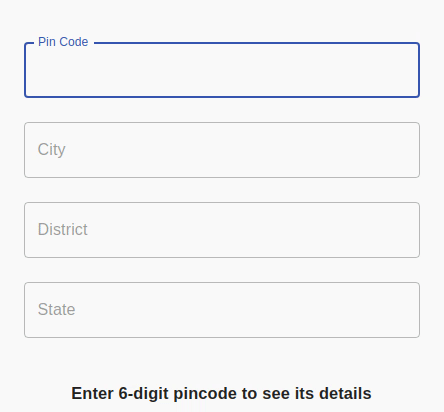

# React Pincode

React Pincode is a published NPM module that can be integrated inside any ReactJS application. It is used to extract City, District, and State information as soon as the user enters valid Pin-Code. On entering a valid Pin-Code, a GET request is made to the Indian Postal Service API and the useful information is extracted and results are displayed in the respective fields. If a valid Pincode is entered an error is thrown which can be customized by a user using a specific prop.

<div align="center">
    
    
    
</div>


#### Snippet of the working application is displayed below.



## Table of Contents
- [About](#about)
- [Prerequisites](#prerequisites)
  - [Note](#note)
- [Working](#working)
  - [JS](#js)
  - [Playground](#playground)
- [Pincode props](#pincode-props)
- [Example](#example)
  - [JS](#js-1)
  - [Development and Testing](#development-and-testing)
- [Contributing](#contributing)
- [Development Guidelines](#development-guidelines)
- [Owner](#owner)


## About

The four input fields are wrapped inside an ```<div>``` element and each input field is also wrapped inside ```<div>```. So that a user can style it according to the need in the project.

Whenever the wrong Pincode is entered red border appears on the pin code input field and on entering a right pin code, city, district and state input fields get automatically filled with correct data


## Prerequisites
* NodeJS (check for it's installation on terminal using ```npm -v```)

### Note
This will only work for Indian Pincodes.

## Working

```js
import Pincode from "react-pincode";
```

### JS

```js
import React, { Component } from 'react';
import Pincode from "react-pincode";

export default class Example extends Component {
  render() {
    return (
      <div>
        <Pincode />
      </div>
    )
  }
}
export default Example;
```

### Playground

Find Codepen Implementation of the module [here](https://codepen.io/adityabisoi/pen/poJQXzx)

## Pincode Props

1) Props for changing CSS properties

| Name             | Description                                     |
| ---------------- | ----------------------------------------------- |
| Container        | Container which wraps all the three Input Field |
| pincodeContainer | Container which wraps pincode Input Field       |
| cityContainer    | Container which wraps City Input Field          |
| districtContainer| Container which wraps District Input Field      |
| stateContainer   | Container which wraps State Input Field          |
| pincodeInput     | Props for styling pincode input field           |
| cityInput        | Props for styling city input field              |
| stateInput       | Props for styling state input field             |


2) Props for changing error message.

By deafult,

* For an Invalid Pincode - "Invalid PIN Code"
* If Pincode length is not valid - "ZIP code must be of 6 digits"

| Name             | Description                                     |
| ---------------- | ----------------------------------------------- |
| invalidError     | Props for changing invalid error message.       |
| lenghtError      | Props for changing invalid length  message.     |


## Example

### JS

```js
import React, { Component } from 'react';
import Pincode from "react-pincode";

export default class Example extends Component {
  render() {
    return (
      <div>
        <Pincode  cityInput={{width:'200px'}}/>
        // This will set the length of city input field to 200px. You can play with rest of the props to style it according to your need.
      </div>
    )
  }
}
export default Example;
```
### Development and Testing

1. Set-up the React-Pincode module by dowloading its dependencies, using `npm install` command.	
2. Build the module using `npm run build`	
3. Link the module for testing using `npm link` command.	
4. Change your directory to `test-server` directory, using `cd test-server`	
5. Install the dependecies using `npm install`	
6. Now run `npm link react-pincode`	
7. Congratulations! You have set-up the test server for react-pincode.	
Now just run `npm start` from `test-server` directory to launch the test-server.	
8. You don't need to stop this server, the changes made in the module will be reflected automatically each time you build them using `npm run build`
9. To watch a video on installation (Click on the thumbnail):
[](https://www.youtube.com/watch?v=DtBObHLaQDA)	

## Contributing
Please read [Contributing Guidelines](./CONTRIBUTING.md) for information on how to contribute to React-Pincode.

## Development Guidelines
1. Write clean and readable code with proper formatting.
2. Create a branch and push your code in the branch.
3. Please follow PR template to create one.
4. Please read our [Code of Conduct](./CODE_OF_CONDUCT.md) .

## Owner
[Apoorv Taneja](https://github.com/plxity)   

