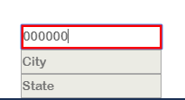
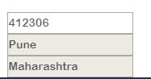

# React Pincode

[](https://github.com/plxity/React-Pincode)

[](https://github.com/plxity/React-Pincode)
## Installation

```
npm install --save react-pincode
```

## Usage

### Note
This will only work for Indian Pincodes.


The three input fields are wrapped inside an ```<div>``` Element.
and each input field is also wrapped inside ```<div>```. So that a user can style it according to the need in the project.

Whenever the wrong Pincode is entered red border appears on the pin code input field and on entering a right pin code, city and state input fields get automatically filled with correct data


## Working

```js
import Pincode from "react-pincode";
```

### JS

```js
import React, { Component } from 'react';
import Pincode from "react-pincode";

export default class Example extends Component {
  render() {
    return (
      <div>
        <Pincode />
      </div>
    )
  }
}

export default Example;
```

## Pincode Props

| Name             | Description                                     |
| ---------------- | ----------------------------------------------- |
| Container        | Container which wraps all the three Input Field |
| pincodeContainer | Container which wraps pincode Input Field       |
| cityContainer    | Container which wraps City Input Field          |
| stateContainer   | Container which wraps StateInput Field          |
| pincodeInput     | Props for styling pincode input field           |
| cityInput        | Props for styling city input field              |
| stateInput       | Props for styling state input field             |

## Example

### JS

```js
import React, { Component } from 'react';
import Pincode from "react-pincode";

export default class Example extends Component {
  render() {
    return (
      <div>
        <Pincode  cityInput={{width:'200px'}}/>
        // This will set the length of city input field to 200px. You can play with rest of the props to style it according to your need.
      </div>
    )
  }
}

export default Example;
```
##Testing and Contribution

1)Copy the test-server folder from outside the react-pincode module.
2)From react-pincode run : npm install => npm run-script build => npm sink
3)Go to test-server directory and run : npm install => npm link react-pincode => npm start

This will start a development server on your localhost.

Now everytime you make changes to your react-pincode module and run 'npm run-script build' from inside, those changes will get reflected to your locally running server.

